X-Date: 2022-03-06T12.00.00 Subject: Инструкция по публикации вещей на Decentraland X-Slug: happy

**Внимание!!** Оригинальная статья [тут](https://docs.decentraland.org/decentraland/wearables-editor-user-guide/), перевод был выполнен 05.03.2022, перевод не является дословным, в нем присутствуют авторские изменения или дополнения

**Что такое редактор носимых устройств?**

Редактор носимых устройств – инструмент, с помощью которого возможно загрузить и опубликовать свои собственные, кастомные вещи.

### Вход 

Для загрузки и публикации носимых устройств перейдите на сайт builder.decentraland.org. Авторизуйтесь доступным способом, например через MetaMask. После этого кликните на вкладку Collections.

### Загрузка носимых устройств

Если у вас еще нет загруженных вещей, кликните New Item или New Collection. Если вы уже загружали что-то, вы можете отредактировать это, кликнув на item или collection, а затем на edit. Если вы загружаете новую вещь, кликните на значок «+» рядом с кнопкой «Open Editor».

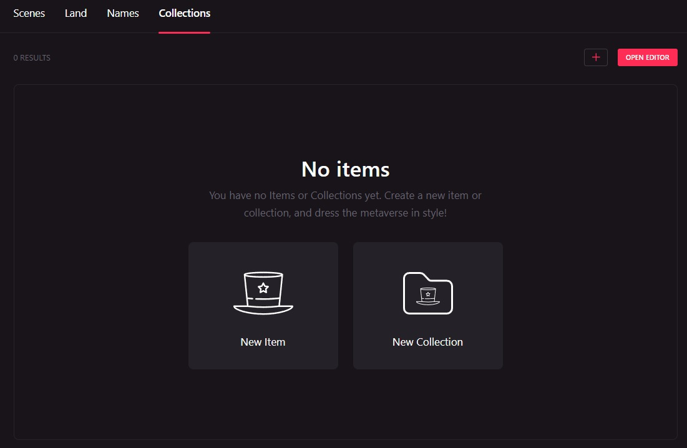

### Создание коллекции

Когда вы создаете коллекцию, вы даете ей название и нажимаете Create.

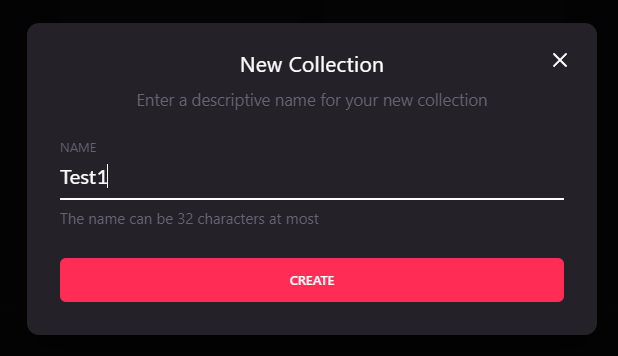

После того, как вы создали коллекцию, вы можете добавлять в нее вещи.

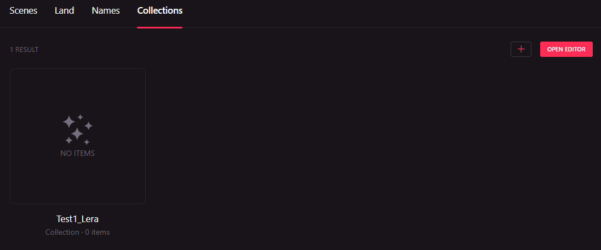

**Название коллекции не может изменяться после публикации!**

Вы можете добавить сколько угодно вещей до публикации коллекции. Но всегда помните, что вы не можете добавлять, удалять или изменять кол-во товаров к продаже по одной единицы (например вы сделали футболку и установили, что их будет продано только 10, после публикации вы не сможете поменять это число).

Для добавления вещей в коллекцию, перейдите в коллекцию и нажмите New Item и выберите вещь для загрузки.

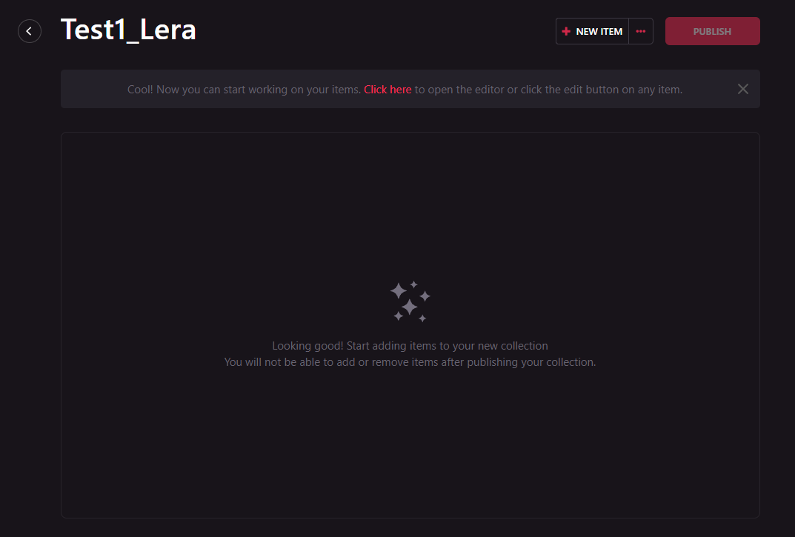

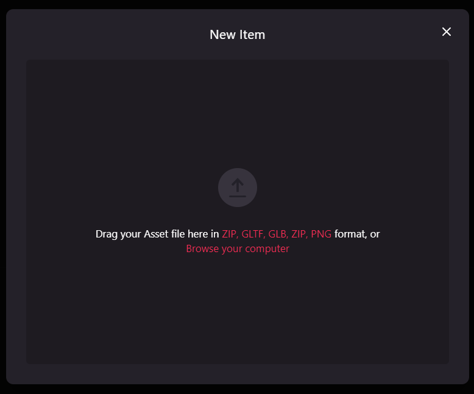

Для теста я загрузила [футболку](https://drive.google.com/drive/folders/1C_VBUpvPcrWgEIuT7ejTOonsT_dc6Sj9?usp=sharing), которая предоставляется в наборе от Decentraland (ссылку на все тестовые вещи можно найти в статье «Построение 3D моделей носимых устройств в Decentraland (общая информация)»). 

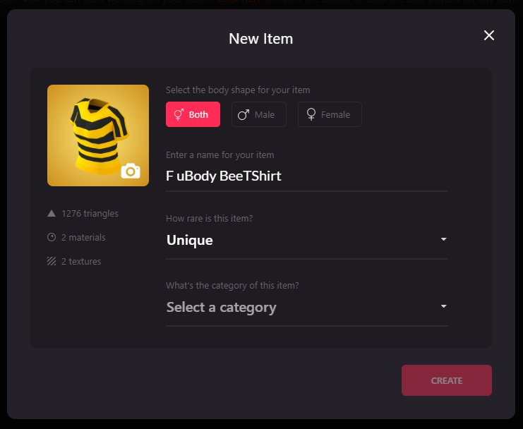

После загрузки файлов формата glb и json (на текущей момент вещь не должна превышать 2 МБ) было предложено добавить изображение товара (миниатюры должны быть размером 256 на 256 пикселей с прозрачным фоном, вещи, содержащие миниатюры без прозрачного фона, не будут приняты), выбрать пол, для которого эта вещь подходит, ввести название для вещи, выбрать кол-во к продаже (нельзя выбрать любое число, кол-во будет представлено в выпадающем списке) и определить к какой части тела этот товар относится.

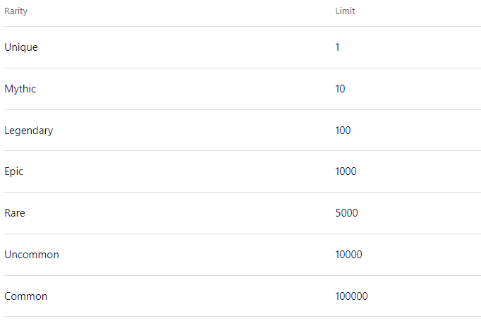

Также вы сразу сможете увидеть сколько у вас используется материалов, полигонов и текстур в добавленной вещи.

После загрузки вещи, вы можете назначить цену по кнопке Set price. Цены устанавливаются в Mana.

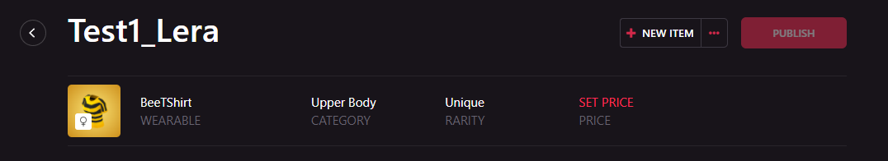

### Бенефициар (получатель прибыли)

После продажи, средства будут поступать на ваш Ethereum address (например, если вы регистрироваться через Metamask, подтянется адрес данного кошелька). Вы можете использовать любой адрес эфира, который захотите. Для изменения адреса кошелька, в окне указания суммы на товар нажмите I’m the Beneficiary.

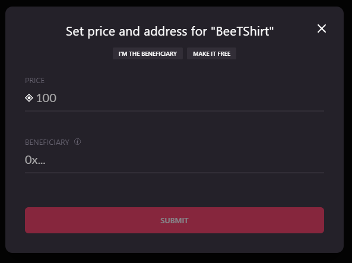

Вы также можете выбрать Make it Free, если хотите, чтобы ваш товар был бесплатным. Перепродавать его смогут при желании за деньги (новый владелец). После того, как адрес выбран, а цена назначена, нажмите Submit.

### Публикация вещей

После того, как добавлены все данные по товару, можно начать процесс публикации. Для этого необходимо нажать на кнопку Publish. 

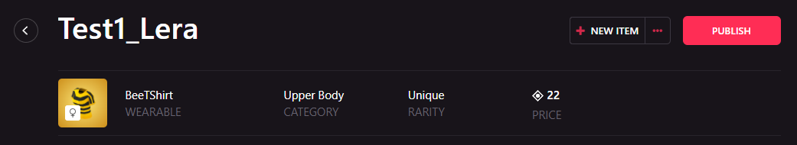

Далее будет предложено авторизовать Mana контракт, чтобы управлять Mana от своего имени (делается один раз).

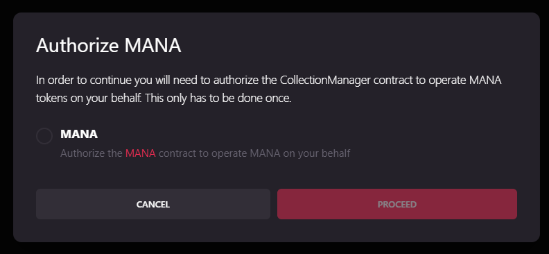

Предоставляя данное разрешение, вы разрешаете контракту Mana снимать Mana c вашего счета, чтобы оплатить рассмотрение вашего товара и публикацию + зачислять Mana на ваш счет при продаже. После того, как вы нажмете кнопку Proceed, вы получите сообщение от своего кошелька для подтверждения, это не облагается тратами на gas.

### Комиссия за публикацию

За публикацию вещей взимается комиссия. Сделано это чтобы избежать спам. Комиссия за одну вещь составляет 500 Mana (в статье можно найти поправку, связанную с ростом валюты и переходом к 500 $).

Для примера, если вы публикуете коллекцию с 2 товарами, комиссия составит 1000 Mana (далее, опираясь на поправки, буду писать $) не учитывая сколько у вас заложено продаж каждой единицы.Комиссия будет направлена на развитие платформы. 

Из-за необходимости затрачивать ресурсы на рассмотрения каждой единицы товара (рассматривает DAO), затраченные средства не будут возвращены в случае отклонения коллекции. 

**Внимание!** Вы не сможете добавить или удалить товары в своей коллекции после начала процесса публикации. Вы сможете увидеть свои товары на маркетплейсе Decentraland, но они не будут доступны для покупки, продажи, пока не будет получен апрув.

Когда вы будете готовы к публикации, нажмите кнопку Publish и подтвердите сообщение от вашего кошелька. 

### Соавторство

Если коллекция сделана с кем-то совместно, вы можете добавить атрибуты соавтора через Wearables Editor. Это может быть сделано после публикации коллекции.

На сайт builder.decentraland.org, выберите вкладку Collections. Выберите коллекцию, содержащую товары, для которых вы хотите добавить атрибуты соавтора. Кликните на иконку … icon рядом с кнопкой Mint Items и выберете Collaborators.

Для добавления соавторов введите их Ethereum адреса и кликните Add. Ограничений на добавления соавторов нет. Для удаления соавтора, достаточно будет удалить его адрес. 

### Продажа товаров

После того, как вещи будут заапрувлены, может начаться их продажа. Товары могут продаваться и перепродаваться. Первичные продажи осуществляются с помощью смарт-контракта Decentraland Store. 

При первичной продаже товар продается по цене установленной вами в Wearable Editor. Вторичная продажа выполняется с помощью смарт контракта Decentraland Marketplace.
Это происходит каждый раз, когда пользователь продает предмет на торговой площадке после того, как он был отчеканен или куплен на первичной продаже.

### Первичная продажа

Первичная продажа происходит, когда ваша вещь куплена первый раз. Такая продажа осуществляется через Decentraland Store’s smart контракт. Когда юзер совершил первичную покупку одной из ваших вещей, магазин создаст вещь самостоятельно, передаст товар покупателю и отправляет выручку на адрес получателя.

**Помните!** У вас нет необходимости создавать каждый раз копии вещей при первичной продаже. 

### Укажите цену и адрес получателя

Выберете коллекцию, которую вы бы хотели продавать и назначьте цену и получателя для каждого товара. Beneficiary address – это адрес, на который придет Mana.  Если цена у товара 0, то юзер сможет приобрести товар бесплатно (надо будет оплатить gas) и при желании перепродать потом по любой цене. Вы можете изменить цену и получателя для каждой вещи в своей коллекции в любое время. P.s. данная информаиця описана в главах выше, но тут дополнительно указано, что получателя и цену можно будет поменять после публикации

### Включение первичных продаж

Финально, переключите свич On Sale и кликните Turn On в появившемся окне подтверждения. После этого коллекция будет доступна для покупки. 

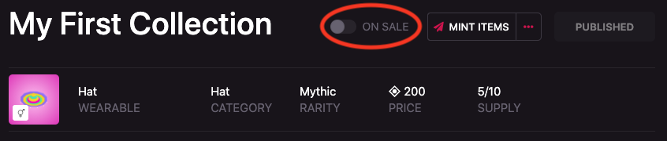

Пока свич On Sale будет включен, Decentraland store будет автоматически создавать (чеканить) вещи для покупки. Это значит, что вы можете продавать каждую вещь до тех пор, пока не будет исчерпан изначально заданный лимит. Если вы хотите сохранить непроданными несколько своих вещей, то необходимо создать до продажи вещи на свой кошелек. 
Кто угодно, кто купит одну из ваших вещей, сможет ее перепродать по той цене, которую он установит. 

Все первичные продажи в Decentraland облагаются комиссией 2,5%. Эта плата переводится в DAO.

**Если я продал вещь через первичную продажу, могу ли я получить свою Mana через Polygon?**
Да, выручка от любых товаров, проданных на Polygon, будет храниться в данной цепочке. Вам придется заплатить комиссию за транзакцию, если вы хотите перевести свою Mana из цепочки Polygon в основную цепочку Ethereum. Вы можете сделать это со страницы Учетной записи.

Если вы хотите перевести Mana, которую вы получили раньше от продажи товаров на Polygon в сеть Ethereum, вы должны будете заплатить gas. Больше информации читайте [здесь](https://decentraland.org/blog/announcements/polygon-mana/). 

### Отключение первичных продаж

Для этого необходимо переключить свич On Sale, который мы рассматривали ранее. Это будет применено только к первичным продажам. 

### Перепродажи

Товары могут быть перепроданы в любое время и по любой цене. Другими словами, кто угодно, кто владеет NFT может продать это на маркетплейсе Decentraland. Комиссии при вторичной продаже не взимаются.

### Создание (чеканка) вещей

Чеканка - это процесс создания NFT основанной на тех вещах, которые вы загрузили через Wearables Editor.

Как и в случае первичных продаж, вы не сможете чеканить какие-либо товары в коллекции до завершения процесса проверки. Если ваша коллекция находится на ревью, вы можете увидеть статус “Under Review”.  После пройденного ревью и получения апрува, статус сменится на “Published” и вы можете начать чеканить свои товары вручную.

### Редкость вещи

Когда вы публикуете коллекцию, каждый товар в этой коллекции имеет редкость. Редкость назначается вами, когда вы загрузили товар и это записывается в смарт контракт. Редкость ограничивает кол-во каждой единицы, доступной к продаже. 

### Сеть Polygon

Все вещи в Decentraland печатается на сети Polygon. Это позволяет юзерам чеканить и передавать товары без уплаты gas (при условии, что эти транзакции осуществляются исключительно в цепочке Polygon). 

### Как вручную чеканить вещи

Чтобы отчеканить опубликованные элементы, откройте коллекцию, содержащую элементы, которые вы хотите отчеканить, и нажмите "Mint Items".

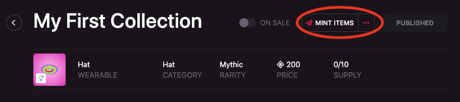

Вам будет показано окно содержащее список вещей, доступных для чеканки с их кол-вом. Например, если ваш запас равен 0/10, значит, вы использовали 0 из общего запаса в 10 единиц.

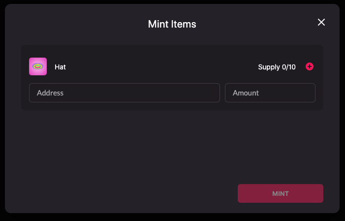

Вы должны настроить адрес на который будет назначена вещь и кол-во вещей, которые вы хотите, чтобы были отпечатаны для этого адреса. Вы не сможете отчеканить больше товаров, чем было выставлено при публикации. Если вы ввели свой собственный адрес, то отчеканенные предметы будут переведены на ваш счет.Вы можете подарить вещь, введя адрес человека, которому хотите подарить в разделе Address.

Помните, вещи, отчеканенные вручную и переданные на адрес, передаются бесплатно.  Цена, которую вы устанавливаете для товаров, собирается только при первичных продажах.

Внимание!! В настоящее время вы можете чеканить только 50 предметов за транзакцию.

**Есть ли какие-то сборы при чеканке вещей?**
Нет, вещи, отчеканенные на цепи Matic не имеют сборов.
